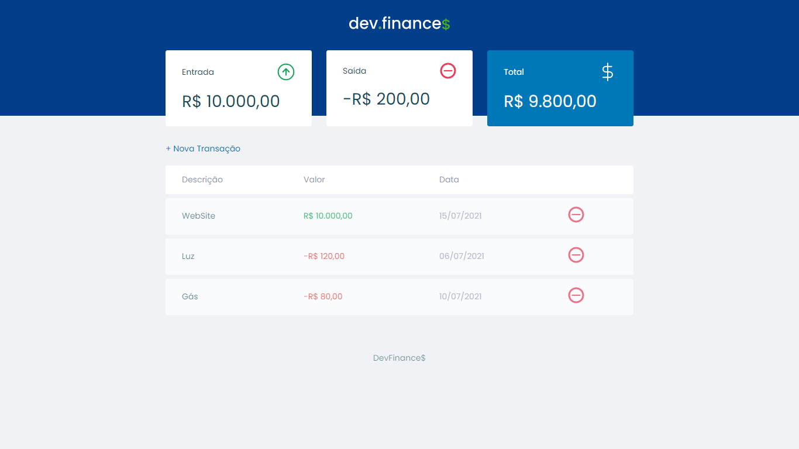

  

<h1 align="center">
    
</h1>

## ⚛ Tecnologias

Esse projeto foi desenvolvido com as seguintes tecnologias:

- HTML
- CSS
- JavaScript

## ⚙ Como executar

Abra o arquivo index.html em seu navegador de preferência, e explore o projeto.

## 💻 Projeto

Dev.finance$ é um projeto simples, porém muito prático e util na hora de controlar suas despesas.

- Responsivo
- Operações salvas no localStorage, direto no navegador.

## 📝 License

Esse projeto está sob a licença MIT.

Desenvolvido por [Mateus Marcelino](https://github.com/mateuzus)
